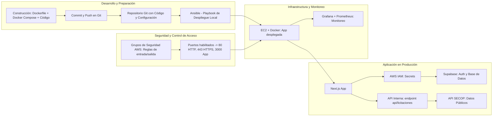

# SECOP Consultas - Sistema de Licitaciones Públicas.

Sistema web para consulta y análisis de licitaciones públicas del SECOP (Sistema Electrónico de Contratación Pública) de Colombia, con una arquitectura moderna, segura y automatizada para despliegue en AWS.

---

## Características Principales

- **Autenticación Segura** con **Supabase**.
- **Visualización Avanzada**: tabla con paginación, filtros múltiples y búsqueda por texto.
- **Diseño Responsive** compatible con cualquier dispositivo.
- **UI Moderna** con animaciones, gradientes y componentes reutilizables.
- **Arquitectura Contenerizada**: despliegue con Docker y automatización vía Ansible.
- **Gestión Segura de Credenciales** mediante AWS IAM.
- **Monitoreo en Tiempo Real** con Grafana + UptimeKuma "Sistema de alertas en tiempo real a telegram"

---

## Arquitectura y Flujo de Despliegue

**1. Desarrollo y Backend Integrado**  
- Aplicación **Next.js** con API interna.  
- Autenticación y sesiones persistentes con **Supabase**.  
- Variables de entorno y claves gestionadas por **AWS IAM**.  

**2. Contenerización y Orquestación**  
- Imagen Docker construida desde el **Dockerfile** del repositorio.  
- Despliegue automatizado con **Ansible** vía **SSH** (.pem).  
- EC2 configurada con **grupos de seguridad** y **gestión de puertos**.  

**3. Monitoreo y Observabilidad**  
- **Grafana** y **Prometheus** para monitoreo de métricas (CPU, RAM, estado de contenedores).  
- Alertas configuradas para caídas de servicio o alta carga.  

**Mapa de Arquitectura:**



---
## Tecnologías Utilizadas

**Frontend:**  
- Next.js 15.2.4, React, TypeScript  
- Tailwind CSS v4, Radix UI, Lucide React  
- React Hook Form, Zod, Context API  

**Backend / API Interna:**  
- Next.js API Routes  
- Integración con datasets SECOP  

**Infraestructura y DevOps:**  
- Docker, Ansible, AWS EC2, AWS IAM  
- Supabase (Auth + DB)  
- Grafana + Prometheus para monitoreo  

---

## Prerrequisitos

- Node.js 18+  
- pnpm (recomendado) o npm  
- Cuenta en Supabase  
- Acceso a AWS IAM y EC2 con clave `.pem`  

---

## Estructura del Proyecto

```
secop-consultas-next/
├── app/                    # App Router de Next.js
│   ├── api/                # Endpoints de API
│   ├── globals.css         # Estilos globales
│   ├── layout.tsx          # Layout principal
│   ├── page.tsx            # Página de inicio
│   ├── login/              # Página de autenticación
│   └── panel/              # Panel principal (protegido)
├── components/             # Componentes reutilizables
├── hooks/                  # Hooks personalizados
├── lib/                    # Utilidades y clientes
├── Dockerfile              # Imagen para contenerización
├── ansible/                # Playbooks de despliegue
└── README.md
```

---

## Autenticación y Seguridad

- **Login**: Email y contraseña vía Supabase.  
- **Protección de rutas** con AuthGuard.  
- **Gestión de secretos**: AWS IAM.  
- **Grupos de seguridad EC2**:
  - Permitir **HTTP (80)**, **HTTPS (443)** y puerto de la app (ej. 3000).
  - Restringir **SSH (22)** solo a IPs autorizadas.  

---

## API y Datos

- **Dataset**: `jbjy-vk9h` (Licitaciones SECOP).  
- **Endpoint interno**: `/api/licitaciones`.  
- **Filtros**: entidad, estado, fecha, valor.  

---

## Automatización de Despliegue

1. Push de cambios a la rama correspondiente en **Git**.  
2. **Ansible** ejecuta:
   - `git pull`
   - `docker build`
   - `docker run` con mapeo de puertos.
3. Verificación de servicio y reinicio automático si falla.  

---

## Monitoreo con Grafana

- **Prometheus** recolecta métricas de contenedores y servidor.  
- **Grafana** presenta dashboards con:
  - Estado de la aplicación.  
  - Consumo de recursos.  
  - Disponibilidad y tiempo de respuesta.  
- Alertas por correo o Telegram en caso de incidentes.  

---

## Despliegue en AWS

```bash
# Ejemplo de despliegue con Ansible
ansible-playbook -i hosts deploy.yml --key-file key.pem
```

---

## Licencia

MIT License.
